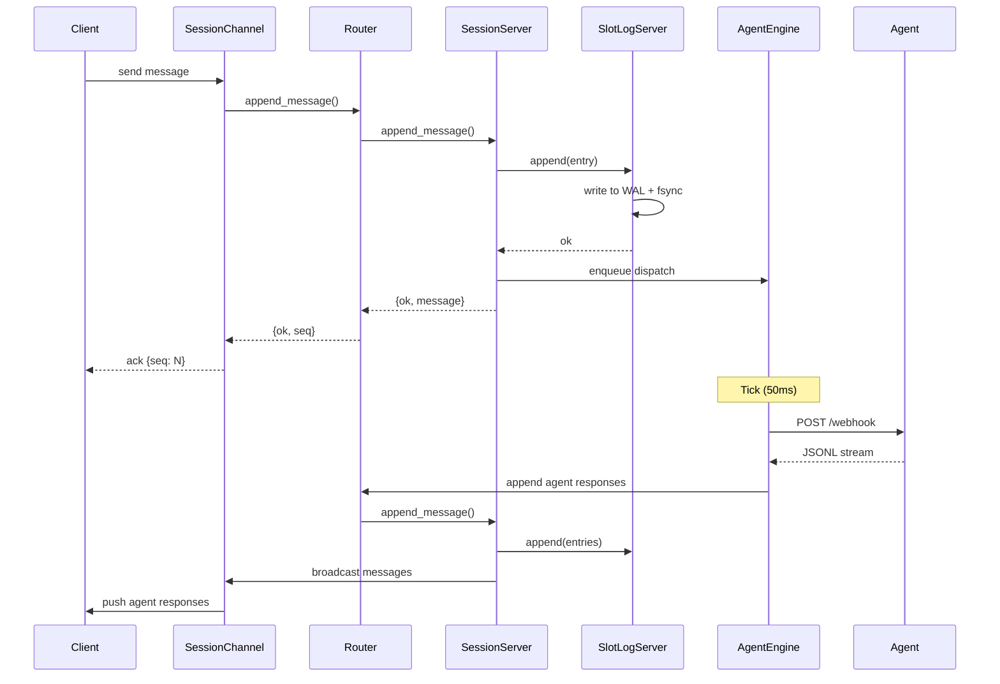

# FleetLM Architecture

FleetLM is designed to run as a single container without too many moving components by leaning heavily on a clustered architecture.

This incurs extra network traffic cost but gives us horizontal scalability and a reduced database engagement on the hot-path. It's ultimately faster to distribute session traffic across nodes and maintain a lightweight append-only log that is flushed every 200–300ms than it is to hit a central point of failure (the database) on each message.


We split traffic into two components that runs on each cluster node:

* **Edge** which is where we receive client traffic. Clients connect with WebSockets that allow us to stream and manage messages for them. This is typically chosen by default to be the closest node to the client itself, such that the entry-point into the cluster is on the edge.
* **Owner-nodes** which are spread out across the cluster. These nodes are responsible for managing a total-order / canonical message log for each session. These are responsible for session management.

> **Note that this also means that it's not necessarily always the same node that is responsible for a single request.**


## Inbox & Session Management

Client communication is split into two paths

- **Inbox**: maintains a holistic view of all sessions for a user. It subscribes to metadata and publishes deltas of what has happened on regular intervals. It allows a user to have multiple sessions active without being overwhelmed with raw message streams. *We maintain one inbox per user*.
- **Session**: a dedicated path for each session. It subscribes to raw data on that session, and allows the client to send messages on the same path. This will firehose all messages as they're published back to the client subscribed to this session. *A user may be in many sessions simultaneously*.

This allows us to split traffic and avoid oversubscribing to data we don't need from a client perspective. For example if a client is juggling 10 sessions that each have 10 messages/s there is no need to receive all of those messages, and thus only subscribe to the currently "active" session in the client UI rather than all at once. The inbox ensures the client can keep track of sessions in need of replay when the end-user navigates to another session for example.

The core idea is that each user has one inbox stream and can join/leave sessions as necessary. On joining a session the client sends the last sequence number (message `seq`) it has seen; FleetLM replays anything newer so the user is caught up.

Session delivery is at-least-once with sequence numbers. On reconnect the client sends `last_seq` and we replay from the local log until caught up. ACKs are implicit via advancing `last_seq`.

### Message Flow



## Storage

FleetLM uses a two-stage write-ahead log (WAL) architecture for flat memory usage under load.

### WAL Commit Log (Primary Storage)

Messages append directly to disk in fixed-size segment files (128MB default). Each entry is framed as `<<len::32, crc32::32, payload::binary>>` with CRC validation on read. This provides:

- **Constant memory overhead** per session regardless of message volume
- **Crash recovery** via cursor persistence and segment repair

Cursors track `{segment, offset}` positions. On SlotLogServer init, invalid or missing cursors default to `{0, 0}` with a warning—no crashes, graceful recovery from the beginning.

**Commit point:** A message is committed when appended and fsync'd to the WAL (batched every 512KB or 25ms). Publication happens immediately after commit.

### Background Flush (Secondary Persistence)

WAL segments stream to Postgres in 4MB chunks every 300ms (configurable). Flushed entries are removed from disk, keeping WAL size bounded. Database writes are:

- **Batched** (5000 messages/insert for Postgres param limits)
- **Non-blocking** (supervised tasks under `SlotLogTaskSupervisor`)
- **Cursor-tracked** so restarts resume from last flushed position

Database lag is intentional & configurable, making DB load predictable and removing it from the hot path under stress.

> Traditional designs use Postgres/external storage as the source of truth, requiring careful tuning under load. FleetLM's WAL-first approach keeps memory flat, latency low, and tolerates database slowdowns without dropping messages.

## Sharding & Supervision

The WAL architecture requires single-writer semantics per session. We distribute sessions across the cluster using consistent hashing (hash ring) to balance load.

### Session Distribution

**Key behaviors:**
- **Hash ring** maps each session to an owner node deterministically
- **Sticky routing** keeps active sessions on their current node (ignores hash ring)
- **SessionTracker** (Phoenix.Tracker CRDT) provides cluster-wide session → node mapping
- Sessions marked `:draining` reject new appends with backpressure, allowing clean handoff

### Lifecycle & Isolation

- **SessionServer** (`:transient` restart) crashes are isolated—only that session restarts
- **SlotLogServer** (`:permanent`) runs independently per storage slot—crashes don't cascade
- **Runtime.Supervisor** uses `:one_for_one` strategy, preventing cascading restarts
- Storage, registries, and session processes are fully isolated

When cluster topology changes (scale up/down):
1. HashRing recalculates ownership
2. RebalanceManager marks moved sessions as `:draining`
3. SessionServer drains (flushes WAL → DB, terminates)
4. SessionTracker auto-removes on process death
5. Next request routes to new owner, starts fresh SessionServer

No split-writes, no data loss—cursor-based recovery handles restarts gracefully.

## Agent Dispatcher

Agents are served by a single per-node dispatch engine. Session servers never talk directly to the engine; they simply place lightweight entries into ETS when a user sends a message. The engine polls the queue at a fixed cadence, spawns supervised tasks for webhook dispatch, and retries with exponential backoff on failure.

### Dispatch Pipeline

1. **Enqueue:** `SessionServer` calls `Agent.Engine.enqueue/4`. The call upserts a single ETS table (`:agent_dispatch_queue`) with the schema:
   ```
   {key, user_id, last_sent, target_seq, due_at, first_seq, enqueued_at, attempts, status}
   ```
   Multiple user messages collapse into a single queue row by updating `target_seq` and `due_at`. Dispatch status (`:pending`, `:inflight`, `nil`) is tracked directly in ETS.
2. **Scheduler tick:** `Agent.Engine` wakes every `agent_dispatch_tick_ms` (default 50ms) and selects due sessions where `due_at <= now` and `status != :inflight`. At most one dispatch runs per session at a time.
3. **Async dispatch:** Each session spawns a supervised task under `Agent.Engine.TaskSupervisor`. The task builds the payload, performs the webhook via Finch (HTTP/2 connection pool), streams JSONL responses, and appends agent messages via `Router`. On success it updates `last_sent` and clears dispatch fields. On failure it requeues with exponential backoff capped at `agent_dispatch_retry_backoff_max_ms`.
4. **Back-pressure:** When tasks are saturated, sessions remain in the queue. New messages keep extending `target_seq`. No payloads are held in memory, and telemetry tracks queue length for saturation monitoring.

### Observability

The engine emits telemetry by default, and can be consumed using prometheus.

### Streaming Message Model

We deliberately reuse the [AI SDK UI stream protocol](https://ai-sdk.dev/docs/ai-sdk-ui/stream-protocol) for agent replies. The trade-off is that agents (or their adapters) must speak the same chunk vocabulary (`text-*`, `tool-*`, `finish`, etc.), but the benefit is that the exact payload the assembler sees is the payload the frontend already knows how to render. There is no bespoke translation layer or schema mismatch between webhook responses and the LiveView UI—streamed parts flow straight through.

`Fleetlm.Agent.StreamAssembler` keeps streaming a session channel the moment chunks arrive while compacting the sequence into one persisted assistant message when it sees a terminal chunk. That lets us expose true streaming UX (every delta is forwarded as-is) without sacrificing a durable append-only log or message compaction.

## Why Elixir?

The BEAM VM was built for telecom systems: fault-tolerant, highly concurrent, excellent at IO. FleetLM leverages:

- **OTP supervision trees** for process isolation (`:one_for_one` prevents cascades)
- **Phoenix.Tracker CRDTs** for distributed session tracking without coordination
- **ETS** for lock-free agent dispatch queues
- **Erlang file I/O** for efficient WAL segment writes

Owner nodes enforce single-writer per session. On failure, the hash ring reassigns ownership, cursor recovery resumes from the last flushed position, and appends continue on the new owner—no fencing required.
