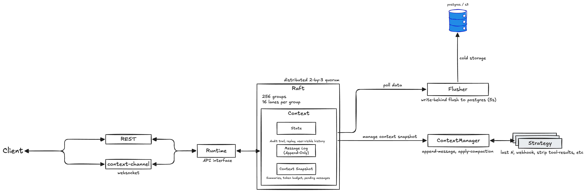

# FleetLM Architecture

FleetLM is designed to run as a single container without too many moving components by leaning heavily on a clustered architecture.

This incurs extra network traffic cost but gives us horizontal scalability and a reduced database engagement on the hot-path. It's ultimately faster to distribute session traffic across nodes and maintain a lightweight append-only log that is flushed every 200–300ms than it is to hit a central point of failure (the database) on each message.


We split traffic into two components that runs on each cluster node:

* **Edge** which is where we receive client traffic. Clients connect with WebSockets that allow us to stream and manage messages for them. This is typically chosen by default to be the closest node to the client itself, such that the entry-point into the cluster is on the edge.
* **Owner-nodes** which are spread out across the cluster. These nodes are responsible for managing a total-order / canonical message log for each session. These are responsible for session management.

> **Note that this also means that it's not necessarily always the same node that is responsible for a single request.**



## Inbox & Session Management

Client communication is split into two paths

- **Inbox**: maintains a holistic view of all sessions for a user. It subscribes to metadata and publishes deltas of what has happened on regular intervals. It allows a user to have multiple sessions active without being overwhelmed with raw message streams. *We maintain one inbox per user*.
- **Session**: a dedicated path for each session. It subscribes to raw data on that session, and allows the client to send messages on the same path. This will firehose all messages as they're published back to the client subscribed to this session. *A user may be in many sessions simultaneously*.

This allows us to split traffic and avoid oversubscribing to data we don't need from a client perspective. For example if a client is juggling 10 sessions that each have 10 messages/s there is no need to receive all of those messages, and thus only subscribe to the currently "active" session in the client UI rather than all at once. The inbox ensures the client can keep track of sessions in need of replay when the end-user navigates to another session for example.

The core idea is that each user has one inbox stream and can join/leave sessions as necessary. On joining a session the client sends the last sequence number (message `seq`) it has seen; FleetLM replays anything newer so the user is caught up.

Session delivery is at-least-once with sequence numbers. On reconnect the client sends `last_seq` and we replay from the local log until caught up. ACKs are implicit via advancing `last_seq`.

## Storage

FleetLM runs on a two-stage storage in order to avoid database churn & complexity.

1. **Disk Append-only Log** persists messages in flight before they're published. We assume a singular upstream writer (session) and the disk log becomes our "source of truth" for total order across the entire cluster. We keep the log around and compact it regularly as time goes on to avoid its size growing too large. *This storage layer is our sourc of truth*.
2. **Off-Cluster persistence** ensures that in cases of disk failure we can recover. We regularly move messages from the disk log off into a persistent storage backend (S3/postgres, up to us). This makes the database load predictable and we can bulk transactions. *This storage will always lag behind, by default*.

Commit point: a message is considered committed when appended and fsync'd to the disk log; we then publish. Off-cluster persistence is intentionally behind (target lag in seconds), making DB load predictable and batched.

> Traditional & naive design usually makes a 3rd-party storage the source of truth for messages (e.g. postgres). To get these storages to work effectively under load one usually has to tune them and avoid pitfalls, in addition to building the storage model on top. It's easy to mess that up, and to introduce complexity that later on becomes a mess to untangle and migrate away from.

## Sharding

The storage model we chose (append-only log) requires us to send all traffic that belongs to a singular session to the same session server. To do so we're _distributing the session load_ across the entire cluster by sharding traffic across every node.

- Session servers are lazy loaded and once inactive will drain (flush the last messages to database) and shut themselves down. This ensures that inactive sessions aren't hogging resources continuously.
- When the cluster size changes sessions are moved around, and we drain sessions that are being moved in a blocking manner, no new messages can be appended to a session that is being drained. Messages in-flight will be held by the sharding API for a period of time on the edge node until after the drain/move has been completed.
- We use a deterministic hash & ring buffer in order to assign sessions across the entire set of nodes within the cluster itself. Ring changes are versioned; we block appends during handoff to avoid split-writes.

## Agent Dispatcher

Agents are served by a single per-node dispatch engine. Session servers never talk directly to the engine; they simply place lightweight entries into ETS when a user sends a message. The engine polls the queue at a fixed cadence, spawns supervised tasks for webhook dispatch, and retries with exponential backoff on failure.

### Dispatch Pipeline

1. **Enqueue:** `SessionServer` calls `Agent.Engine.enqueue/4`. The call upserts a single ETS table (`:agent_dispatch_queue`) with the schema:
   ```
   {key, user_id, last_sent, target_seq, due_at, first_seq, enqueued_at, attempts, status}
   ```
   Multiple user messages collapse into a single queue row by updating `target_seq` and `due_at`. Dispatch status (`:pending`, `:inflight`, `nil`) is tracked directly in ETS.

2. **Scheduler tick:** `Agent.Engine` wakes every `agent_dispatch_tick_ms` (default 50ms) and selects due sessions where `due_at <= now` and `status != :inflight`. At most one dispatch runs per session at a time.

3. **Async dispatch:** Each session spawns a supervised task under `Agent.Engine.TaskSupervisor`. The task builds the payload, performs the webhook via Finch (HTTP/2 connection pool), streams JSONL responses, and appends agent messages via `Router`. On success it updates `last_sent` and clears dispatch fields. On failure it requeues with exponential backoff capped at `agent_dispatch_retry_backoff_max_ms`.

4. **Back-pressure:** When tasks are saturated, sessions remain in the queue. New messages keep extending `target_seq`. No payloads are held in memory, and telemetry tracks queue length for saturation monitoring.

### Observability

The engine emits telemetry for queue length, retries, and dispatch completion (queue wait + webhook duration). Webhook-level metrics track HTTP status, parse errors, and end-to-end latency.

## Why Elixir?

The virtual machine that Elixir runs on (BEAM) was originally developed to power telecoms software, and was made for building clusters that are fault-tolerant and highly scalable communications engines. It's excellent at managing IO which is the bulk of the FleetLM workload, and provides a battle-hardened framework (OTP) to scale.

Owner nodes are single-writer per session by design. On owner failure we fence the epoch and hand leadership to the next owner; appends stall briefly and then resume on the new owner.
