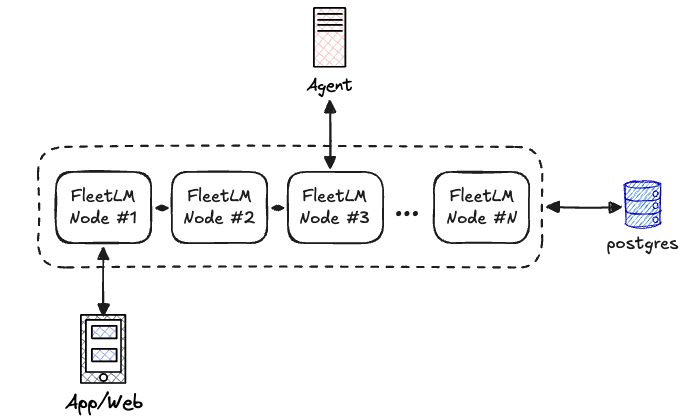

# FleetLM Architecture

FleetLM is built for **predictable latency and zero data loss** in distributed environments. We use Raft consensus for the write path with Postgres as a write-behind cache, trading maximum throughput for operational simplicity and resilience.

## Core Principles

1. **Remove the database from the critical path** - Raft consensus provides quorum writes, Postgres is a write-behind cache
2. **Stateless request handling** - No per-session processes, pure message routing
3. **Horizontal scalability via sharding** - 256 Raft groups distribute load automatically
4. **Boring, battle-tested technology** - Ra (RabbitMQ's Raft), Phoenix.Presence (CRDT), Postgres



Every node in the cluster is identical, no designated "edge" or "owner" nodes. Clients connect to any node via WebSocket. That node routes messages to the appropriate Raft group (determined by hash), which replicates to 2-of-3 replicas before acknowledging. PubSub broadcasts the committed message back to subscribed clients.

> **Key insight:** Raft leader election is automatic. If the node handling your WebSocket dies, reconnect to any other node. If a Raft group's leader dies, followers elect a new leader within ~150ms. The system self-heals.

## Inbox & Session Management

Client communication is split into two paths

- **Inbox**: maintains a holistic view of all sessions for a user. It subscribes to metadata and publishes deltas of what has happened on regular intervals. It allows a user to have multiple sessions active without being overwhelmed with raw message streams. *We maintain one inbox per user*.
- **Session**: a dedicated path for each session. It subscribes to raw data on that session, and allows the client to send messages on the same path. This will firehose all messages as they're published back to the client subscribed to this session. *A user may be in many sessions simultaneously*.

This allows us to split traffic and avoid oversubscribing to data we don't need from a client perspective. For example if a client is juggling 10 sessions that each have 10 messages/s there is no need to receive all of those messages, and thus only subscribe to the currently "active" session in the client UI rather than all at once. The inbox ensures the client can keep track of sessions in need of replay when the end-user navigates to another session for example.

The core idea is that each user has one inbox stream and can join/leave sessions as necessary. On joining a session the client sends the last sequence number (message `seq`) it has seen; FleetLM replays anything newer so the user is caught up.

Session delivery is at-least-once with sequence numbers. On reconnect the client sends `last_seq` and we replay from the local log until caught up. ACKs are implicit via advancing `last_seq`.

### Message Flow


## Storage Architecture

FleetLM prioritizes **availability and predictable latency** over maximum throughput. We use battle-tested distributed consensus (Raft) instead of custom replication, trading single-node performance for multi-datacenter resilience.

### Design Goals

1. **Predictable p99 latency** (under 150ms) even under load spikes
2. **Zero data loss** during node failures or network partitions
3. **Horizontal scalability** without manual sharding
4. **Simple mental model** - no eventually-consistent quirks to debug

### The Trade-Off: Raft vs Custom WAL

**Why Raft (what we chose):**
- Proven consensus algorithm (used by etcd, Consul, CockroachDB)
- RabbitMQ's Ra implementation is battle-tested at massive scale
- Automatic leader election, log replication, split-brain protection
- Quorum writes guarantee durability (2-of-3 replicas before ack)

**Cost:**
- Quorum write latency: ~8-14ms on localhost, 20-50ms cross-AZ
- Throughput reduction: ~2.5x lower than single-node (network + replication overhead)
- Network amplification: 1 write becomes 3 (leader + 2 followers)

**Why we accept this:**
- Chat workloads are latency-sensitive, not throughput-constrained
- Eliminating unpredictable disk fsync spikes worth the quorum cost
- No manual failover, no split-brain debugging, no data loss investigations
- Horizontal scaling via more groups when needed

### How It Works

**256 Raft groups** distribute load across the cluster. Each group maintains independent consensus:

- **3 replicas** spread across nodes (tolerates 1 node failure)
- **Deterministic placement** via rendezvous hashing (minimal reshuffling on topology changes)
- **Parallel writes** within each group (16 lanes per group = 4096 total write streams)

Messages map to groups via hash(session_id), eliminating hotspots. Each group's Raft leader accepts writes, replicates to followers, and only acks after majority commit.

**Conversation state lives in RAM:** Each group caches `{session_id → last_seq}` in the Raft state machine. Sequence assignment is a pure in-memory operation—no database query required. This is the key latency win.

**Hot message tail in ETS:** Recent messages (~5000 per lane, 3-5 seconds) stay in ETS rings for instant replay. Older messages served from Postgres.

### Postgres: The Durable Cache

Postgres is **not** on the critical path. A background flusher streams committed Raft state to the database every 5 seconds:

- **Batched writes** (5000 messages per insert to respect Postgres parameter limits)
- **Idempotent** (duplicate inserts ignored via unique constraint)
- **Non-blocking** (flush failures don't stop new appends)

If Postgres goes down, appends continue—messages queue in Raft state until the database recovers. On cold start, the system replays from Postgres then resumes from Raft.

**Snapshots** compact Raft logs: every 100k appends, the state machine snapshots to Postgres. Ra discards log entries below the watermark, keeping memory bounded.

> **The philosophy:** Raft handles replication, consensus, and failover. Postgres handles durable archival and analytics. The hot path never waits for the database.

## Cluster Membership & Replica Placement

Operating a Raft cluster introduces a coordination problem: which nodes should host replicas for each of the 256 groups? FleetLM solves this with **rendezvous hashing**—a proven technique from distributed caching.

### Why Rendezvous Hashing?

Traditional consistent hashing (hash rings) requires coordination when nodes join or leave. Rendezvous hashing eliminates this:

- **Zero coordination:** Each node independently computes the same replica assignment
- **Minimal churn:** Adding a 4th node only reassigns ~25% of groups (1/N), not 100%
- **Deterministic:** Same inputs always produce same outputs across all nodes

**How it works:** For each group, score all available nodes using hash(group_id, node). Take the top 3 scores. Done. No cluster-wide state sync required.

### Dynamic Membership

Real deployments need rolling updates, autoscaling, and failure recovery. FleetLM handles topology changes automatically using Phoenix.Presence (a CRDT) and Ra's membership APIs.

**Adding a node (e.g., Kubernetes scale-up):**

1. New pod starts, discovers cluster via DNS/service discovery
2. Announces itself in Presence as "joining"
3. Waits for cluster connection, then starts assigned Raft groups
4. Marks itself "ready" once all groups have joined
5. Coordinator node rebalances affected groups (adds new replica)

**Removing a node (e.g., rolling deploy):**

1. Presence detects node departure (drain signal or crash)
2. Coordinator computes which groups lost a replica
3. Removes dead node from Raft membership (Ra handles leadership transfer)
4. System continues with 2-node replicas until replacement joins

**The coordinator** is elected deterministically (lowest node name) to avoid conflicts. Only the coordinator triggers rebalances. Membership changes go through Raft consensus—Ra rejects concurrent changes automatically.

### Failure Modes & Guarantees

**Single node dies:**
- Raft groups on that node lose 1-of-3 replicas
- Remaining 2 nodes still have quorum (2-of-2)
- Writes continue uninterrupted
- System degraded until new node joins (no fault tolerance)

**Network partition (1 vs 2 nodes):**
- Minority side (1 node) cannot achieve quorum
- Returns `:timeout` to clients—no silent data loss
- Majority side (2 nodes) continues serving traffic
- On heal, minority syncs from majority's log

**Split-brain:**
- Impossible by design—Raft quorum prevents dual leaders
- Partitioned minority steps down immediately (no acks)

**Leader election:**
- Automatic on failure (~150ms election timeout)
- New leader has full replicated log (no data loss)
- Clients retry failed requests—at-least-once delivery

### Process Isolation

FleetLM has no per-session processes. The only long-lived processes are:

- **Raft state machines** (256 groups × 3 replicas = ~768 processes cluster-wide)
- **Background flusher** (1 per node, streams to Postgres)
- **Topology coordinator** (1 per node, monitors cluster changes)

Crashes are localized—Ra supervises state machines internally, OTP supervises the rest with `:one_for_one` strategy. No cascading failures.

## Known Bottlenecks & Mitigation

### 1. Raft Quorum Latency

**Bottleneck:** Every write replicates to 2-of-3 nodes before acknowledgment. Cross-AZ deployments add 5-20ms network RTT.

**Impact:**
- Single-node: p95 = 6ms
- 3-node localhost: p95 = 14ms (+8ms quorum cost)
- 3-node cross-AZ: p95 = 30-50ms (network-bound)

**Mitigation:**
- Deploy replicas in same AZ (1-3ms RTT) for latency-sensitive workloads
- 256 groups × 16 lanes provide 4096 parallel write streams for throughput

**When this becomes a problem:** Cross-region deployments where network latency exceeds 50ms. Deploy regional clusters independently in this scenario.

### 2. Postgres Connection Pool Contention on Cold Reads

**Bottleneck:** Replaying old sessions (last_seq far behind) triggers DB queries. If flush lag is high (Postgres slow or down), the ETS ring doesn't have the requested messages.

**Impact:**
- ETS ring holds ~5000 messages per lane (3-5 seconds)
- Requests for messages older than ring → Postgres query
- High concurrency + slow Postgres → pool exhaustion (default: 20 connections)
- Queries block until connection available → timeout failures

**Mitigation:**
- Increase `pool_size` in prod (e.g., 50-100 connections for high cold-read workload)
- Monitor `fleetlm_raft_state_pending_flush_count` metric—if >50k, Postgres is lagging
- Tune `raft_flush_interval_ms` (default: 5000ms) to reduce lag at cost of more frequent DB writes
- Consider read replicas for cold reads (separate pool)

**When this becomes a problem:**
- Users frequently reopening old sessions (weeks/months old)
- Postgres cannot keep up with flush rate (undersized instance)
- Memory exhaustion if flush lag grows unbounded

**Operational guidance:** Monitor `fleetlm_raft_state_pending_flush_count` in production. Alert if sustained above 50k messages. Scale Postgres vertically or add read replicas for cold read traffic.

## Agent Dispatcher

Agents are served by a single per-node dispatch engine. The Runtime API enqueues dispatch requests after committing user messages to Raft. The engine polls the queue at a fixed cadence, spawns supervised tasks for webhook dispatch, and retries with exponential backoff on failure.

### Dispatch Pipeline

1. **Enqueue:** `Runtime.append_message/6` calls `Agent.Engine.enqueue/4` after Raft commit. The call upserts a single ETS table (`:agent_dispatch_queue`) with the schema:
   ```
   {key, user_id, last_sent, target_seq, due_at, first_seq, enqueued_at, attempts, status}
   ```
   Multiple user messages collapse into a single queue row by updating `target_seq` and `due_at`. Dispatch status (`:pending`, `:inflight`, `nil`) is tracked directly in ETS.
2. **Scheduler tick:** `Agent.Engine` wakes every `agent_dispatch_tick_ms` (default 50ms) and selects due sessions where `due_at <= now` and `status != :inflight`. At most one dispatch runs per session at a time.
3. **Async dispatch:** Each session spawns a supervised task under `Agent.Engine.TaskSupervisor`. The task builds the payload, performs the webhook via Finch (HTTP/2 connection pool), streams JSONL responses, and appends agent messages via `Runtime.append_message`. On success it updates `last_sent` and clears dispatch fields. On failure it requeues with exponential backoff capped at `agent_dispatch_retry_backoff_max_ms`.
4. **Back-pressure:** When tasks are saturated, sessions remain in the queue. New messages keep extending `target_seq`. No payloads are held in memory, and telemetry tracks queue length for saturation monitoring.

### Observability

The engine emits telemetry by default, and can be consumed using prometheus.

### Streaming Message Model

We deliberately reuse the [AI SDK UI stream protocol](https://ai-sdk.dev/docs/ai-sdk-ui/stream-protocol) for agent replies. The trade-off is that agents (or their adapters) must speak the same chunk vocabulary (`text-*`, `tool-*`, `finish`, etc.), but the benefit is that the exact payload the assembler sees is the payload the frontend already knows how to render. There is no bespoke translation layer or schema mismatch between webhook responses and the LiveView UI—streamed parts flow straight through.

`Fleetlm.Agent.StreamAssembler` keeps streaming a session channel the moment chunks arrive while compacting the sequence into one persisted assistant message when it sees a terminal chunk. That lets us expose true streaming UX (every delta is forwarded as-is) without sacrificing a durable append-only log or message compaction.

## Why Elixir?

The BEAM VM was built for telecom systems: fault-tolerant, highly concurrent, excellent at IO. FleetLM leverages:

- **OTP supervision trees** for process isolation (`:one_for_one` prevents cascades)
- **Phoenix.Presence (CRDT)** for cluster-wide ready-node tracking without coordination
- **ETS** for lock-free agent dispatch queues and Raft message rings
- **Ra (Erlang Raft)** for distributed consensus (RabbitMQ's battle-tested implementation)

Raft handles replication, leader election, and split-brain protection automatically. On leader failure, followers elect a new leader within ~150ms. All committed writes are replicated to majority (2-of-3 nodes) before acknowledgment—no fencing, no manual failover required.
