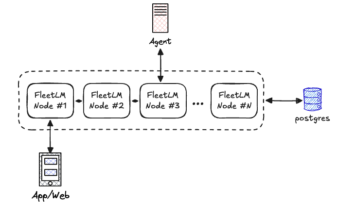

# FleetLM

**Context infra for LLM apps.**

Context management is killing your costs. RAG + pub/sub + compaction + persistence = complexity that balloons fast.

**FleetLM handles the full lifecycle: persist, replay, compact, deliver.**

Write stateless REST. Deploy with docker compose. We handle state, ordering, replay.

**[Quick Start](./quickstart.md)**

## The Context Complexity Trap

1. Simple LLM calls → works great
2. Add persistence → need database
3. Multi-device sync → need pub/sub
4. Context limits hit → need compaction
5. Debug sessions → need event log
6. **Five systems. Distributed nightmare.**

**FleetLM does all of this out of the box.**

## What You Get

- **Framework freedom** – agents are plain webhooks, keep your stack (FastAPI, Express, Go)
- **Durable ordering** – Raft consensus, at-least-once delivery, zero data loss
- **Real-time delivery** – WebSockets stream every message, REST for polling
- **Automatic failover** – Raft leader election handles crashes (~150ms recovery)
- **Horizontal scale** – 256 Raft groups shard traffic across nodes

> **FleetLM makes LLM infra as boring as it should be.** Run it once, stop thinking about gnarly chat infrastructure.

**[GitHub Repository](https://github.com/cpluss/fleetlm)**

**[FleetLM Homepage](https://fleetlm.com)**

See [Architecture](./architecture.md) for how Raft consensus, Presence, and Postgres work together.

## Docs

- [Quick Start](./quickstart.md) – clone the repo, run Compose, send your first message.
- [Agent Webhooks](./agents.md) – payload schema, response format, registration knobs.
- [Clients](./client.md) – REST endpoints and Phoenix Channel usage.
- [Deployment](./deployment.md) – environment variables and scaling notes.
- [Architecture](./architecture.md) – how FleetLM routes traffic, stores messages, and handles failover.
